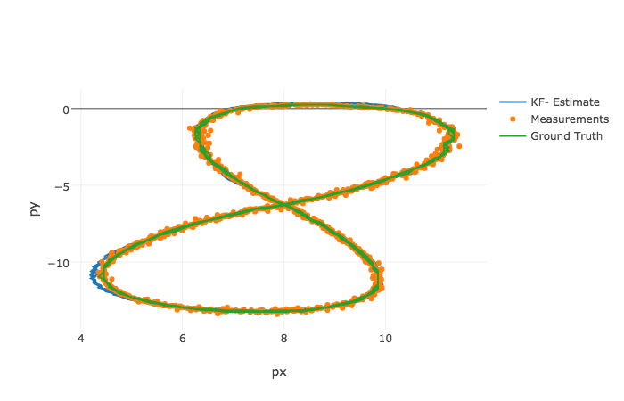
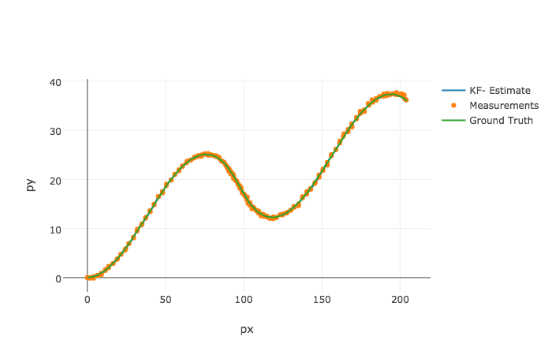

# udacity.carnd.extended-kalman-filter
Udacity Self-Driving Car Nanodegree Term 2 Project 1: Extended Kalman Filter

# Build Instructions
```
mkdir build && cd build
cmake .. && make
```

# Run Sample Input Files
```
./build/ExtendedKF data/sample-laser-radar-measurement-data-1.txt output-1.txt
./build/ExtendedKF data/sample-laser-radar-measurement-data-2.txt output-2.txt
```

# Results

### Figure 8


### Double Hump


### Root Mean Square Error

|Test Input|X-Position|Y-Position|X-Velocity|Y-Velocity|
|---|---|---|---|---|
|Figure 8|0.0752665|0.0747091|0.484197|0.532599|
|Double Hump|0.180892|0.189185|0.439929|0.837125|
